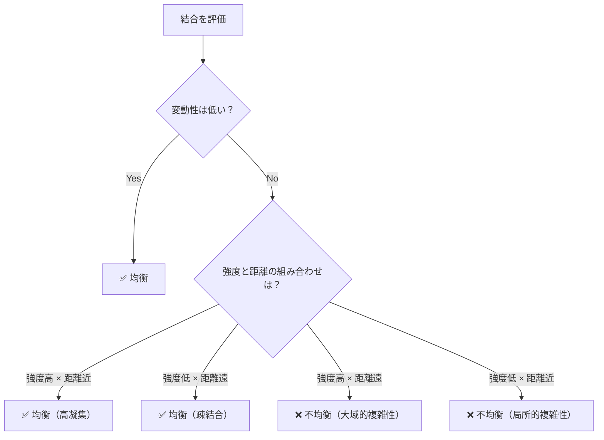
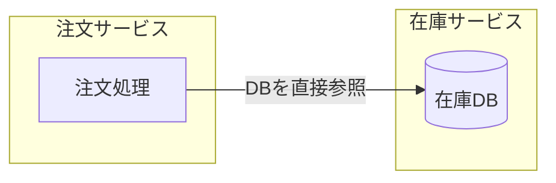
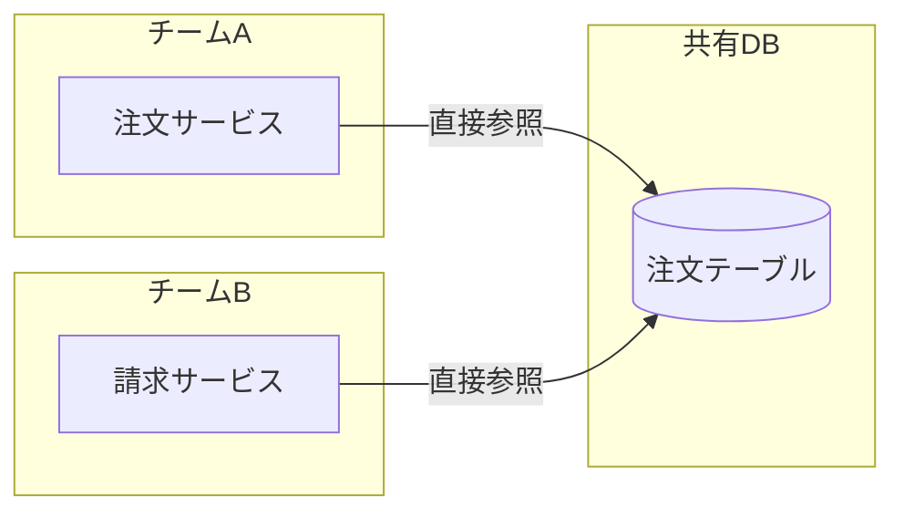
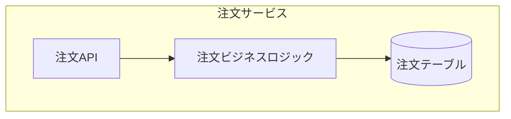
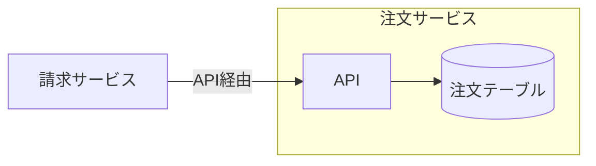
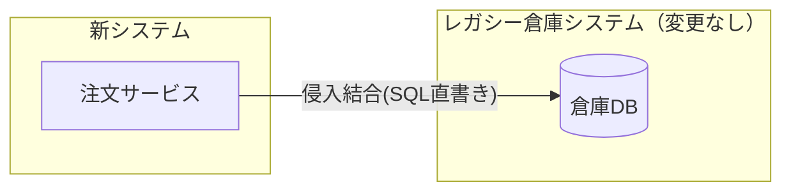
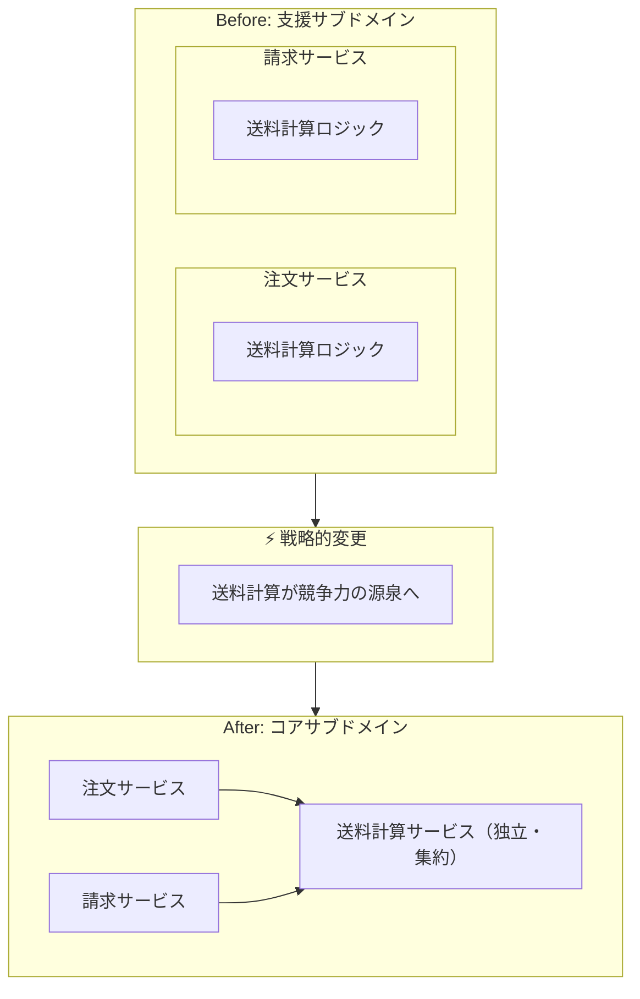

一般的にソフトウェアのモジュール設計は「凝集度」や「結合度」といったモデルによって評価され、「高凝集・疎結合が良い設計の指標」として広く知られています。

@[card](https://ja.wikipedia.org/wiki/%E5%87%9D%E9%9B%86%E5%BA%A6)
@[card](https://ja.wikipedia.org/wiki/%E7%B5%90%E5%90%88%E5%BA%A6)

しかし、これらの既存のモデルだけでは現代のソフトウェア設計の課題に十分に対応できない場面があります。具体的には、以下のような観点が欠けています。

- 物理的につながっていない結合（ロジックの重複など）を評価する枠組みがない
- 同じ結合でも、同じファイル内か別チーム間かで変更の労力はまったく違う
- 「どこに設計のコストをかけるべきか」という優先順位の調整弁がない

「ソフトウェア設計の結合バランス」では、これらの課題に対して**均衡結合モデル**という新たな枠組みを提案しています。結合は「排除するもの」ではなく「コントロールするもの」であり、**統合強度**・**距離**・**変動性**という3つの次元で結合を評価・調整することで、持続可能な設計を実現できるという主張です。

@[card](https://book.impress.co.jp/books/1124101149)

均衡結合モデルの判定は、以下の論理式で表現されます。

```text
均衡度 = (強度 XOR 距離) OR NOT 変動性
```

XORは「2つの値が異なるとき真」を意味する論理演算です。この式は**強度が高ければ距離が近く・強度が低ければ距離は遠い、という対応関係が成り立っているか、もしくは変動性が低ければ、設計は均衡している**ことを意味しています。



本記事では、この書籍から学んだ均衡結合モデルの重要な点を3つに絞って紹介します。

## 物理的な接続がなくても結合は存在する

構造化設計の「モジュール結合」はインターフェイスの種類（公開インターフェイスか実装詳細か）を分類するのに長けており、オブジェクト指向設計の「コナーセンス」はインターフェイスを通じて共有される知識の複雑さ（名前だけの合意か、型や順序の合意も必要か）を評価するのに長けています。

@[card](https://ja.wikipedia.org/wiki/%E7%B5%90%E5%90%88%E5%BA%A6)
@[card](https://en.wikipedia.org/wiki/Connascence)

しかし、これらのモデルには共通の盲点があります。どちらもメソッド呼び出しやデータの受け渡しといったコード上の物理的な接続を前提としているため、物理的には接続されていないが同じ知識に依存しているコンポーネント間の結合を捉えられません。たとえば、2つのサービスが物理的には接続されていなくても、同じビジネスルールに依存していれば、そのルールが変わったとき両方を修正する必要があります。

本書では、この盲点を補完するために**結合の本質は物理的な接続ではなく共有された知識であるとして捉え直した「統合強度」という新しいモデル**を提案しています。共有される知識の種類によって結合の強さは大きく異なるという考えに基づき、統合強度は4つのレベルに分類されます。

以下では、ECサイトの「注文処理と在庫管理の連携」を例に、それぞれの結合レベルを説明します。

### 侵入結合

もっとも強い結合です。あるコンポーネントが他のコンポーネントの非公開の実装詳細に依存している状態を指します。

たとえば、注文サービスが在庫サービスのデータベースを直接読み書きしているケースがこれに該当します。

```typescript
// 在庫サービスのDBテーブル構造に直接依存
const reserveStock = async (productId: string, quantity: number) => {
  await db.query(
    "UPDATE inventory_items SET stock = stock - ? WHERE product_id = ?",
    [quantity, productId]
  );
};
```



**統合のために意図されていない非公開の部分に依存しているため、内部実装の変更が即座に依存側を破壊します**。

### 機能結合

ビジネスロジックや機能を共有している状態です。機能結合にはさらにいくつかのサブカテゴリ（実行順序の依存、トランザクションの共有など）がありますが、そのなかでもっとも強く、もっとも見落とされやすいのが「対称機能結合」です。これは、複数のコンポーネントが物理的には接続されていないにもかかわらず、同じビジネスルールを重複して実装している状態を指します。

よくあるパターンとして、以下のようなケースが挙げられます。

- チームが分かれていて、それぞれが独立して同じビジネスルールを実装してしまう
- モノリスからマイクロサービスに分割する過程で、同じロジックが複数のサービスに残る
- 共有ライブラリにするとデプロイ結合が生じるため、あえて複製を選ぶ

たとえば、注文サービスと在庫サービスが、それぞれ独自に「安全在庫を下回る場合は引き当て不可」という同じ判定ロジックを実装しているケースです。2つのサービス間にはAPI呼び出しも共有データベースもありません。しかし、安全在庫の基準が変更されれば、両方のサービスを同時に修正しなければシステムは矛盾した動作を引き起こします。

```typescript
// order-service.ts
const canReserve = (currentStock: number, quantity: number): boolean => {
  const safetyStock = 5; // 安全在庫
  return (currentStock - quantity) >= safetyStock;
};

// inventory-service.ts（同じロジックが重複）
const canReserve = (currentStock: number, quantity: number): boolean => {
  const safetyStock = 5;
  return (currentStock - quantity) >= safetyStock;
};
```

物理的な痕跡が一切ないため、**静的解析ツールやアーキテクチャ図では発見できず、開発者が変更の影響範囲を見落とすリスクがもっとも高い**結合の形態です。

### モデル結合

ドメインモデルのデータ構造を共有している状態です。

たとえば、在庫サービスが内部で使用している`InventoryItem`型をそのまま注文サービスに返却しているケースがこれに該当します。

```typescript
// inventory-service.ts
// 内部管理用の型
type InventoryItem = {
  productId: string;
  stock: number;
  // 利用者には不要な内部情報
  supplierId: string;
  warehouseLocation: string;
  lastRestockedAt: Date;
};

// order-service.ts
// 内部情報を含む巨大な型に依存
const checkStock = (item: InventoryItem): boolean => {
  return item.stock > 0;
};
```

**エンティティの構造が変更されると、それを参照するすべてのコンポーネントに影響がおよびます**。

### コントラクト結合

もっとも弱い結合です。統合専用に設計された契約（コントラクト）のみを共有している状態を指します。各コンポーネントの内部モデルとは独立した、統合のためだけに設計されたインターフェイスを介して連携します。

たとえば、上記のモデル結合を改善し、内部の`InventoryItem`型を返却する代わりに、統合専用の契約を設計するケースがこれに該当します。

```typescript
// 統合専用の契約（コントラクト）
type StockCheckRequest = {
  productId: string;
};
type StockCheckResponse = {
  isAvailable: boolean;
};

// inventory-service.ts
const checkStock = (request: StockCheckRequest): StockCheckResponse => {
  const item = findByProductId(request.productId);
  return { isAvailable: item.stock > 0 };
};

// order-service.ts
// 契約のみに依存、内部実装の変更に影響されない
const placeOrder = async (productId: string) => {
  const result = await inventoryClient.checkStock({ productId });
  if (!result.isAvailable) throw new Error("在庫切れ");
};
```

**内部実装やドメインモデルが変更されても、コントラクトが変わらなければ他のコンポーネントに影響しません**。

## 結合の強さと距離で変更コストは見積もられる

統合強度によって結合の「強さ」を評価できるようになりました。

そもそもなぜ結合の強さを評価したいのでしょうか。それは、変更のコストを予測し、管理したいからです。結合が強いほど変更の影響が波及しやすいため、結合を弱く保つことで将来の変更コストを抑えることができます。

しかし、結合の強さだけでは変更コストを正確に見積もることはできません。同じ強さで結合していても、修正箇所が同じクラス内の2つのメソッドなのか・異なるチームが管理する2つのマイクロサービスなのかによって、変更にかかる労力はまったく異なります。

本書ではこの観点について、**距離**という次元を導入し、統合強度と組み合わせて設計のモジュール性を評価する枠組みを提案しています。

距離は、結合されたコンポーネント間の物理的・組織的な隔たりを表現します。

| 距離 | 物理的な隔たり | 組織的な隔たり |
| :---: | :--- | :--- |
| 近い | 同じクラス内のメソッド | 同じ人が実装 |
| ↓ | 同じモジュール内のクラス | 同じチーム |
| ↓ | 異なるパッケージ / ライブラリ | 異なるチーム |
| 遠い | 異なるサービス / システム | 異なる部門・組織 |

本書では、将来の変更を容易にする能力として「モジュール性」を定義しています。モジュール性は、統合強度と距離を以下の論理式で評価します。これは冒頭で示した均衡度の式の前半部分にあたります。

```text
モジュール性 = 統合強度 XOR 距離
```

この式の意味するところは、

- **疎結合にするために距離を離すだけでは不十分で、コンポーネント間の距離を離すなら、それに見合うように共有する知識（統合強度）も減らす必要がある**
- **逆に、強い結合が必要なコンポーネントは近くに配置すべきである**

ということです。

統合強度と距離の組み合わせによって、設計の状態は以下の4つのパターンに分類されます。

| | **距離: 近い** | **距離: 遠い** |
| :--- | :--- | :--- |
| **強度: 高い** | 高凝集（良い結合） | 大域的複雑性 |
| **強度: 低い** | 局所的複雑性 | 疎結合（良い分離） |

### 強度が低い × 距離が近い = 局所的複雑性

関連性のないコンポーネントが同じ場所に混在している状態です。本書ではこの状態を**局所的複雑性**と呼んでいます。

たとえば、注文処理を行うファイルに、在庫確認・配送ルート計算・通知送信といった機能的に関連のない関数が詰め込まれているケースがこれに該当します。

```typescript
// order.ts - 機能的に関連のない関数が1ファイルに混在
const placeOrder = (productId: string, quantity: number) => { /* ... */ };

// なぜここに？
const checkWarehouseStock = (productId: string) => { /* ... */ };

// なぜここに？
const calculateShippingRoute = (from: string, to: string) => { /* ... */ };

// なぜここに？
const sendOrderNotification = (email: string) => { /* ... */ };
```

変更の影響は波及しませんが、無関係なコードが混ざっているため「何が重要か」「どこを直せばよいか」を把握するための認知負荷が増大します。

### 強度が低い × 距離が遠い = 疎結合（良い分離）

関連性が低いコンポーネントが離れて配置されている状態です。一般的に**疎結合**と呼ばれます。

たとえば、上記の局所的複雑性を解消するために、責務ごとにモジュールを分離するケースがこれに該当します。

```typescript
// order.ts - 責務ごとにモジュールを分離
const placeOrder = async (productId: string, quantity: number) => {
  await inventoryClient.checkStock(productId);
  await shippingClient.calculateRoute(/* ... */);
  await notificationClient.send(/* ... */);
};
```

距離は遠いですが、共有される知識が最小限であるため、互いに影響を与えずに独立して進化できます。

### 強度が高い × 距離が遠い = 大域的複雑性

強く依存しているのに離れてしまっている状態で、もっとも避けるべきパターンです。本書ではこの状態を**大域的複雑性**と呼んでいます。

たとえば、モノリスからマイクロサービスに分割する際に、データベースの分割が後回しにされた結果、注文サービスと請求サービスが同じDBの注文テーブルを直接読み書きしているケースがこれに該当します。



注文テーブルのスキーマを変更すると、異なるチームが管理する両方のサービスを同時に修正・デプロイする必要があります。マイクロサービスに分割しても共有知識（統合強度）が多ければ、それは分散した巨大な泥団子になるだけです。

### 強度が高い × 距離が近い = 高凝集（良い結合）

強く依存し合うコンポーネントが近くに配置されている状態です。一般的に**高凝集**と呼ばれます。

たとえば、上記の大域的複雑性を解消するために、注文テーブルへのアクセスを注文サービスに集約するケースがこれに該当します。注文の作成・取得・更新といったデータ操作と、それに関連するビジネスロジックが同じサービス内にまとまっています。



注文テーブルのスキーマ変更は注文サービス内に閉じ込められ、変更の影響が波及する範囲が限定されます。

この改善により、請求サービスはAPIを通じて注文情報を取得する形になり、2つのサービスは**高凝集かつ疎結合**な関係になります。



## 変更されないなら複雑なままでも許容される

統合強度と距離の2つの次元で設計の「モジュール性」を評価できるようになりました。

しかし、現実のプロジェクトでは有限の時間のなかで優先順位をつけて設計判断を行う必要があります。すべてのコンポーネントのモジュール性を完璧にする余裕はありません。モジュール性のモデル（強度と距離）だけでは、「どこに設計のコストをかけるべきか」という優先順位の調整弁がありません。

本書では、この調整弁として**変動性**という3つ目の次元を導入しています。変動性とは、コンポーネントがどれくらいの頻度で変更されるかを表す指標です。

### 低変動性では複雑性が許容される

設計が複雑（大域的複雑性や局所的複雑性）であること自体は、必ずしも問題ではありません。複雑性がとくに問題になるのは、**そのコンポーネントに変更を加える必要があるとき**です。

均衡結合モデルの方程式 `(強度 XOR 距離) OR NOT 変動性` に立ち返ると、変動性の役割が明確になります。変動性が低ければ `NOT 変動性` が真となり、強度と距離のバランスにかかわらず式全体が「均衡」と判定されます。つまり、**変更されないものは複雑なままでも問題にならない**のです。

たとえば、注文サービスからレガシー倉庫システムの在庫データを取得する必要があるとします。正規のAPIを構築せず、レガシーシステムのデータベースを直接読み取るという「近道」を選んだ場合、これは侵入結合（もっとも強い結合）かつシステム間（遠い距離）での結合であり、通常であれば大域的複雑性に該当します。



しかし、そのレガシーシステムがすでに開発を終了しており今後変更される予定がなければ、侵入結合の最大のリスクである「変更による破壊」は発生しません。よって、この設計は「均衡している」と判断できます。

では、あるコンポーネントの変動性はどのように見極めればよいのでしょうか。本書では、ドメイン駆動設計（DDD）のサブドメイン分類を変動性の評価ツールとして用いることを提案しています。**汎用サブドメイン**（既存の安定したソリューションで対応できる領域）や**支援サブドメイン**（ビジネスロジックが単純で、一度構築すればめったに変更されない領域）は変動性が低いため、設計が多少複雑でも実害は小さいと判断できます。

DDDのサブドメイン分類についてより詳しく知りたい方は、同じ著者による『ドメイン駆動設計をはじめよう』がオススメです。サブドメインの見極め方や境界づけられたコンテキストとの関係が体系的に解説されています。
@[card](https://www.oreilly.co.jp/books/9784814400737/)

:::message
筆者は「低変動性なら複雑でも許容される」という主張には懐疑的です。

複雑性のコストは変更時だけでなく、コードを理解しようとするとき、バグを調査するとき、そのコンポーネントを使おうとするときにも発生します。また、「開発が終了しているから変更されない」と言っても、依存ライブラリのアップデート、インフラの移行、セキュリティパッチの適用など、環境側の変化によって「何もしていないのに壊れる」ことはソフトウェアでは日常的に起こります。

「今、リファクタリングするのは投資対効果が低い」という経済的な判断基準としては有効ですが、それを「この先もそのままで良い」と解釈するのは危険です。変動性が低いからといって複雑性を放置してよい、という判断には慎重になるべきでしょう。
:::

### 高変動性ではモジュール性が必須である

一方、**コアサブドメイン**（ビジネスの競争優位性を生む領域）は、競合他社の一歩先を行くために継続的な進化が求められるため、変動性がもっとも高くなります。このような領域では、厳密なモジュール性が必要です。

たとえば、注文サービスが割引エンジンと連携するケースを考えます。割引エンジンは競争力の源泉であり、マーケティング戦略に応じて頻繁にロジックが変更されます。

```typescript
// 変動性が高いため、コントラクト結合が必須
const calculateTotal = async (cart: Cart): Promise<number> => {
  // 内部ロジックは知らず、契約のみに依存
  const discount = await discountClient.calculate({
    items: cart.items,
    userId: cart.userId
  });
  return cart.subtotal - discount.amount;
};
```

割引エンジンの内部ロジック（AIモデルや複雑な分岐など）は激しく変動しますが、注文サービスは契約（入力: カート情報、出力: 割引額）のみに依存しているため、内部の変更に影響されません。**システム全体で完璧なモジュール性を目指す必要はないが、変更頻度が高い場所ではモジュール性が必須である**という、実用的な設計指針です。

### ビジネス戦略の変化が変動性を変える

ただし、変動性は固定的なものではありません。ビジネス戦略の変化によって、あるコンポーネントの変動性が低い状態から高い状態へと変わることがあります。

たとえば、送料計算ロジックを考えます。当初、この機能は一律料金の単純な支援サブドメインであり、変更される見込みは低いと判断されました。そのため、注文サービスと請求サービスの両方にロジックをコピー＆ペーストするという設計判断（対称機能結合 × 遠い距離 = 大域的複雑性）が行われましたが、変動性が低いため均衡していると判断されました。



しかし、その後ビジネス戦略が変わり、「動的送料キャンペーン」が競争の鍵（コアサブドメイン）になりました。頻繁な変更が求められるようになった途端、それまで許容されていたロジックの重複が深刻なコストとなり、送料計算サービスとして独立・集約するリファクタリングが必要になりました。

このように、**変動性は「現時点での評価」であり、ビジネス戦略の変化に応じて設計の均衡を見直す姿勢が重要**です。

## さらに深く学ぶために

:::message
本書では、均衡結合モデルを設計の絶対的な評価基準として使うことを意図していません。重要なのは式の結果そのものではなく、統合強度・距離・変動性という3つの次元がどのように連携するかを理解し、設計のトレードオフを議論するための共通言語として活用することです。
:::

本記事では均衡結合モデルについて筆者がとくに重要だと考えた部分のみを紹介しましたが、書籍ではこのモデルに至るまでの理論的背景（クネビンフレームワーク、コナーセンスの詳細、フラクタル幾何学的性質など）や、実践的な適用方法も丁寧に解説されています。結合について深く考えたい方は、ぜひ手に取ってみてください。

@[card](https://book.impress.co.jp/books/1124101149)
