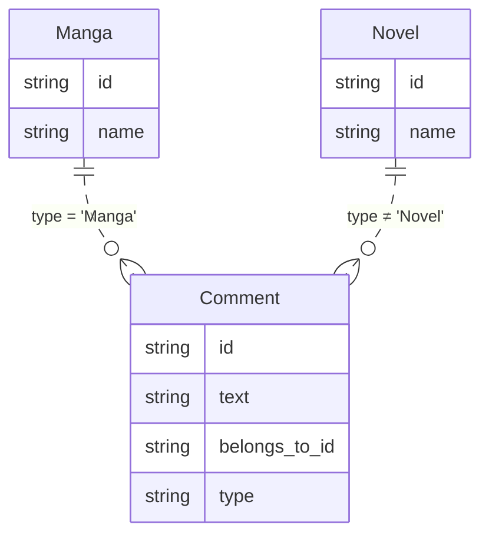
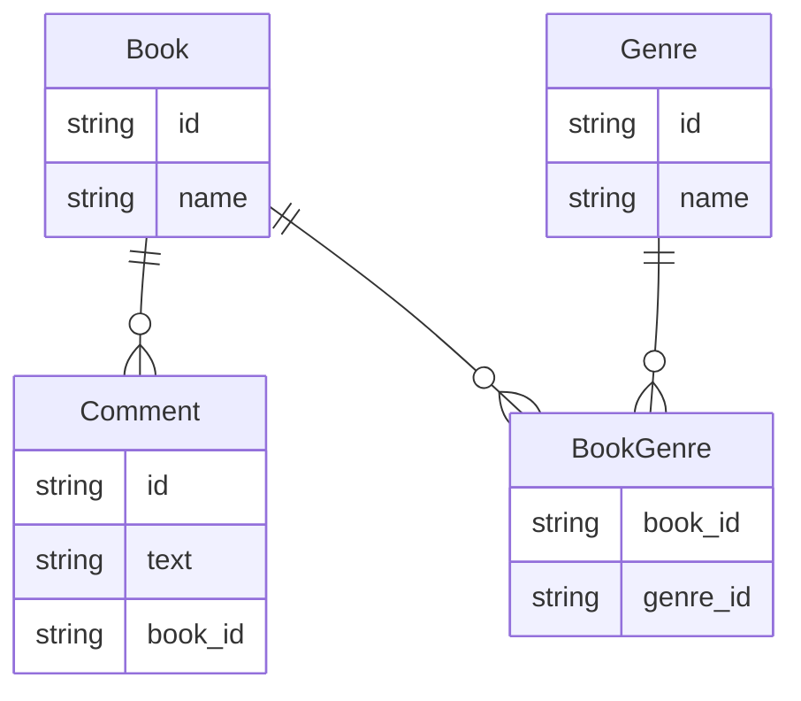
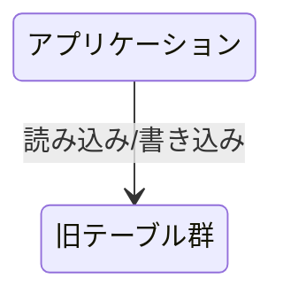
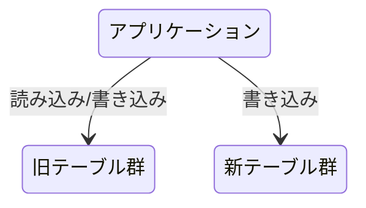
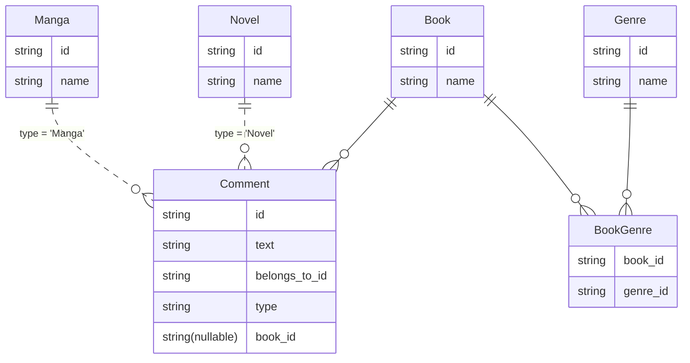
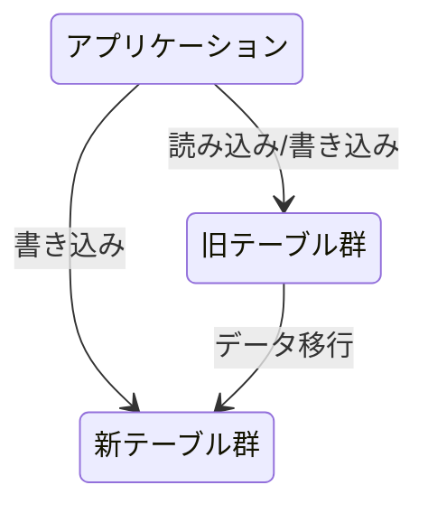
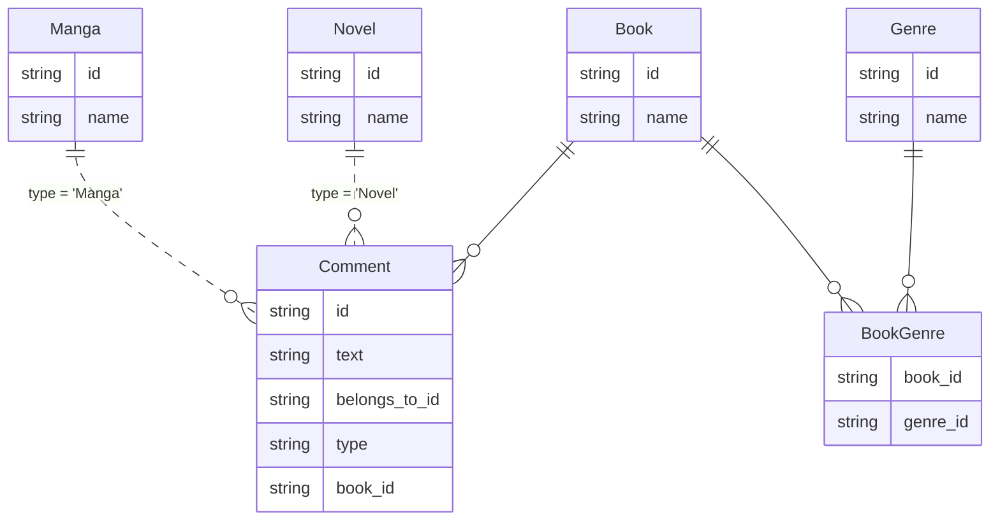
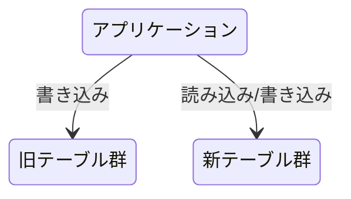
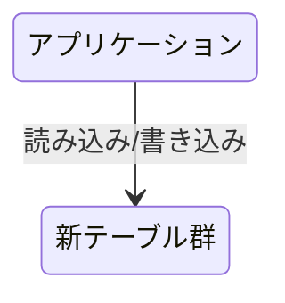

[プラハチャレンジ](https://praha-challenge.com/)にて、受講生チームから次のような質問がありました。

- データベース（RDB）のテーブル設計を変更したい
- テーブル設計を変更する作業中にアプリケーションからデータベースへのアクセスが発生すると困る
- メンテナンス期間を設けアプリケーションを一時的に停止することで、データベースへのアクセスを防ぐことはできる
- データベースを止めることなくテーブル設計を変更する方法はないか

この質問に対して、[Expand and Contract pattern](https://www.prisma.io/dataguide/types/relational/expand-and-contract-pattern)を紹介しました。

この記事では、Expand and Contract patternを用いてテーブル設計を移行する方法を例を交えて紹介します。

## ことのおこり

プラハチャレンジのデータベース設計の課題の1つに、次のようなものがあります。

---

「漫画・小説といった書籍を保存してそれらにコメントできるようなサービス」（以下、書籍サービスとします）のデータベースを想定します。

`belongs_to_id`には`Manga.id`もしくは`Novel.id`が入り、`type`には`manga`もしくは`novel`が入るような設計です。
このテーブル設計の場合、どのような問題が発生すると想定できますか？また、どのような設計だとそれらの問題を避けることができるのでしょうか？

---

どのような問題が発生するか？は本題から逸れるためここでは省略します。受講生チームが考えた新しいテーブル設計は、次のようなものでした。

このテーブル設計の是非は置いておいて、テーブル設計を古いものから新しいものに変更するためにはどうすればいいでしょうか？新しいテーブルを作ったりデータをそちらにコピーしたりする必要がありそうです。
データベースを止めることなくテーブル設計を変更するにはどうすればいいか？Expand and Contract patternを利用するとよさそうです。

## Expand and Contract patternの紹介

Expand and Contract patternとは、RDBのテーブル設計を移行するためのパターンです。複数のステップに分けてデータベースに変更を加えることで、ダウンタイム無し・ロールバック可能なプロセスでテーブル設計を移行できます。

どのようなプロセスでデータベースに変更を加えていくか、書籍サービスの例を交えて説明します。

### 0. 初期状態

初期状態では、アプリケーションは既存のテーブル（旧テーブルとします）に対して読み込み/書き込みを行っています。新テーブルはまだデータベースには存在していません。

書籍サービスは次の図のようになっています

### 1. 新テーブル導入期

新しいテーブルをデータベースに作成します。

書籍サービスは次の図のようになります。

- 新テーブルの`Genre`テーブルに漫画と小説のジャンルを追加します
- 旧テーブルの`Manga`, `Novel`への書き込み時に、新テーブルの`Book`と`BookGenre`への書き込みも行います
- `Comment`には`book_id`カラムをnullableで追加し、書き込み時には`belongs_to_id`と同じ値を`book_id`にも書き込むようにします
- データの読み込みは、旧テーブルから行います

旧テーブルには変更前と同様にデータが書き込まれているため、なにか問題があってもロールバックできます。

この時点では、新テーブルには書き込み始めた時点からのデータしか存在せず、旧テーブルにはそれ以前のデータも存在します。

:::message
新旧テーブルに同時に書き込む際には、トランザクションを利用するなど整合性を保証するための方法を慎重に検討する必要があります。
:::

:::message
ここから旧テーブルが削除されるまでの期間はデータを冗長に保存することになるので、データベース容量の消費と書き込み回数が増加することを考慮する必要があります。
:::

### 2. 新テーブルへのデータ移行

旧テーブルから新テーブルに、すべてのデータをコピーします。データのサイズによってはかなり時間がかかるため、場合によってはバッチなどを使ってバックグラウンドで実行する必要があります。

書籍サービスは次の図のようになります。

- 旧テーブルの`Manga`, `Novel`の値を新テーブルの`Book`にコピーします
- `Comment`の`belongs_to_id`の値を`book_id`にコピーします
  - これで、`book_id`のすべてのレコードに値が入ったので、not null制約と外部キー制約を追加できるようになります

これで、旧テーブル`Manga`, `Novel`と新テーブル`Book`で同じデータを利用できるようになりました。`Comment`の`belongs_to_id`と`book_id`でも同じデータを利用できるようになりました。

この時点でもロールバックは可能ですが、場合によっては新テーブルを一度すべてクリアして再びコピーする必要があります。

:::message
大量のデータをコピーする場合は、データベースのパフォーマンスに影響を与える可能性があるため注意が必要です。
:::

### 3. 新テーブル運用期

新テーブルからデータを読み込むようにアプリケーションを変更します。

書籍サービスは次の図のようになります。

- データの読み込みを新テーブルから行うようにします
- データの書き込みは変わらずどちらにも行います

ロールバック可能な状態にしておくため・データ整合性の検証を可能にするために、旧テーブルへの書き込みは続けます。

### 4. 旧テーブル廃止期

旧テーブルへの書き込みを止めます。

書籍サービスは次の図のようになります。

- 旧テーブル`Manga`, `Novel`への書き込みを止め、テーブルを削除します
- `Comment`の`belongs_to_id`と`type`を削除します

これ以降、データベースへの読み込みも書き込みも新テーブルにのみ影響するようになります。

この手順からロールバックすることは、簡単にはできません。バックアップからデータを復元するなどの対応が必要になり、ロールバックにはデータの損失が伴うようになります。

## Expand and Contract patternのメリット

次のようなメリットがあります。

- データ構造の互換性がない変更であっても、システムを停止させることなく展開できる
- 旧テーブルと新テーブルが同時に存在する期間があるため、テストをすることができる
- ひとつずつロールバックすることが容易である（ただし一度に複数のステップをロールバックした場合、安全は保証されない）
- 大規模なデータの移行が、他のステップとは別のステップとして実行できる
- 最終的には、すべてのデータには一貫性があり、冗長性がない

## Expand and Contract patternのデメリット

次のようなデメリットがあります。

- ダウンタイムは発生しないが、マイグレーション作業を始めてから実際に公開されるまでに時間がかかる
- 計算機資源の問題
  - 一時的にデータを冗長化して保持するため、データベースの容量を専有する領域が増加する
  - 一時的にデータを新旧両方のテーブルに書き込むため、書き込み回数が増加する
  - データの移行時に、移行処理によってデータベースへの負荷が増加する
- 新旧のデータ両方を利用できる期間があり、手動による介入などによって不整合を発生させる可能性がある
- 複数のステップを踏んで作業をしないといけないため、単純に労力がかかる

## Appendix

他にも受講生チームからは、

- データ移行できていることをどうやって担保するのか？
- テーブル設計の変更ログはどうやって残すのか？

などなど、さまざまな質問が来て盛り上がりました。

[プラハチャレンジ](https://praha-challenge.com/)では、こういった議論を日々ワイワイやっております。興味があればぜひご応募ください。
