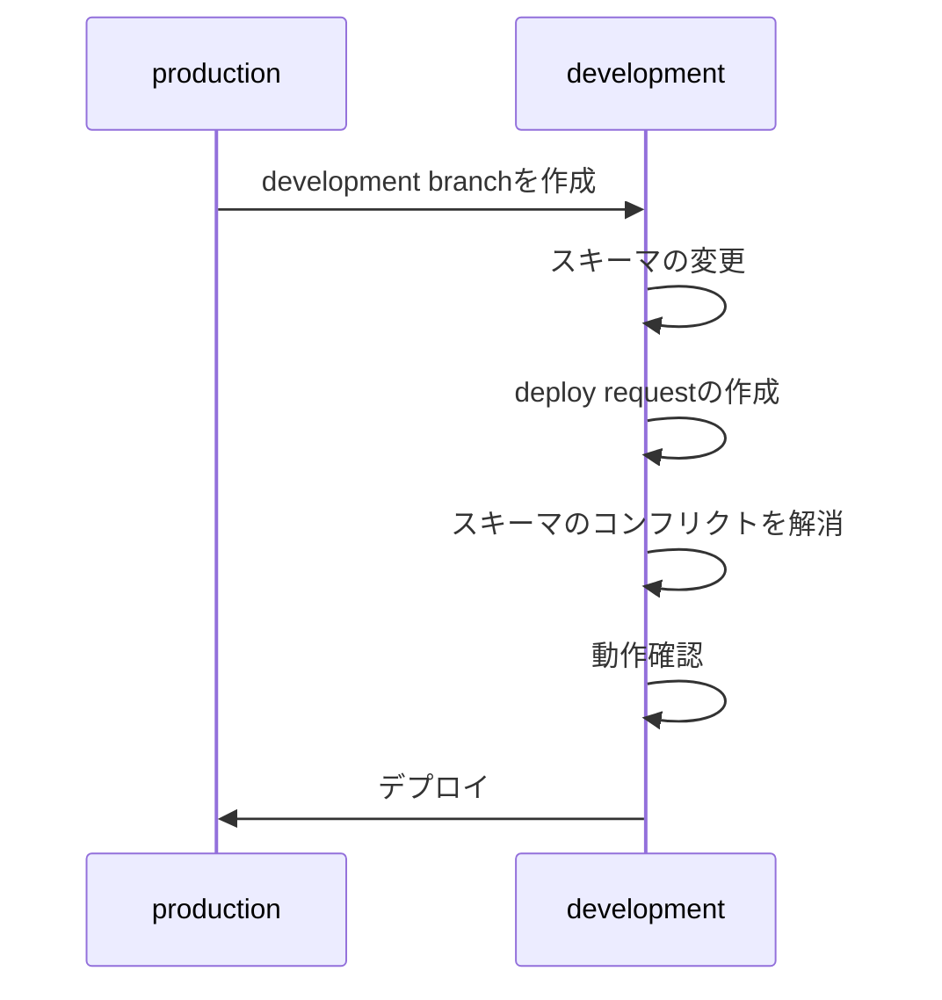

## TL;DR

## PlanetScaleとPrismaについて

PlanetScaleはサーバレスDBサービスです。利用料金の無料枠でできることが充実している、スケーラビリティが高い、などの理由で注目を集めています。個人的には、個人開発における「RDBのランニングコストを抑えたい」「けどバズったときもちゃんと対応したい」という不安を解消できそうなサービスだと思っています。

Prismaは、Node.jsとTypeScriptのためのORMです。宣言的なデータモデリングとマイグレーション機能を提供する「Prisma Migrate」、データモデルから自動生成される型安全なデータベースクライアント「Prisma Client」などを提供しています。DBのモデルとアプリケーションのモデルの型が一致することで、安全なコードを書くことができます。

アプリケーション全体をTypeScriptで開発するのであれば、PlanetScaleとPrismaを組み合わせて使うことで、非常に良い開発者体験を得ることができます。

この記事では、PlanetScaleとPrismaを組み合わせて使うときのDBスキーマのマイグレーションの方法について紹介します。

## 前提

PlanetScaleとPrismaは、それぞれ別のDBスキーマのマイグレーションのための仕組みを持っています。

### PlanetScaleの[Branching](https://planetscale.com/docs/concepts/branching)

PlanetScaleでは「Branching」という機能を使うことで、gitのブランチ機能に近い感覚で、「ブランチ」を作ってDBスキーマを分岐させることができます。

本番用のDBスキーマを変更する必要がある場合、以下の手順で作業を実施します。

1. 本番ブランチから「development branch」を作成します。このブランチ上のDBは、本番DBと同様のスキーマを持った別のDBなので、自由に変更を加えることができます。
2. development branch上のDBに対して、カラムの削除やテーブルの追加などのスキーマの変更を行います。
3. アプリケーションなどからdevelopment branch上のDBを操作し、問題なく動作するかを確認します。
4. 「deploy request」を作成します。
5. PlanetScaleは、deploy requestの開発スキーマと本番スキーマとを比較してスキーマ差分を作成します。スキーマ差分を作成することによって、どのような変更が行われるか、デプロイ可能な要求かどうか（ユニークキーが欠落していないか、などのスキーマの問題点がないかどうかなど）を知ることができます。
6. 開発チームはdeploy requestを確認し、デプロイを承認します。
7. PlanetScaleが新しいスキーマのDBをデプロイ開始します。
8. このデプロイはダウンタイムがゼロになるような方法で実施されるため、テーブルがロックされたり、移行中に本番環境が遅くなるなどの問題が起こることはありません。

詳細は[こちら](https://planetscale.com/docs/concepts/branching)。

### Prismaの[Prisma Migrate](https://www.prisma.io/docs/concepts/components/prisma-migrate)

<!-- TODO: https://www.prisma.io/docs/concepts/components/prisma-migrate/mental-model#how-prisma-migrate-tracks-the-migration-state -->

## PrismaでPlanetScaleのDBスキーマを変更するには

Prisma Migrateは、DBスキーマの状態を追跡するために次の情報を使います

- **prismaのスキーマ**
- **マイグレーション履歴**
- **`prisma_migrations`テーブル**
- **DBスキーマ**

## 参考

<https://planetscale.com/docs/concepts/branching>
